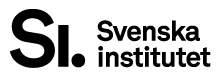

<h3 align="center">
	 
	Swedish Institute
</h3>

	

# The Swedish Institute’s Core Narrative

## Why does the Swedish Institute exist?
We show the world Sweden’s opportunities

## What does the Swedish Institute do?
Our mission is to strengthen, protect and track how Sweden is perceived abroad. A strong international reputation is essential to promoting and safeguarding Swedish interests.

## What is the greatest benefit of the Swedish Institute?
We make Sweden better known around the world. This contributes to prosperity, security and more opportunities to help shape global development.

By raising the visibility and appeal of Swedish ideas, talent and products, we strengthen Sweden’s competitiveness and global reach.

## How does the Swedish Institute work?
Since 1945, the Swedish Institute has worked across many fields – trade, knowledge, culture and development cooperation – to build strong and lasting ties with other countries.This supports Sweden’s success and security in times of war as well as peace.

The scope of our mission reflects Sweden’s versatility: a strong democracy where innovation and talent thrive across many sectors, and where people are empowered to grow and contribute to the creation of a resilient society.

Every day, we work to convey a true, positive and comprehensive image of all that Sweden has to offer, while strengthening exchange and cooperation with other nations

## Index

- Official site: https://sweden.se
